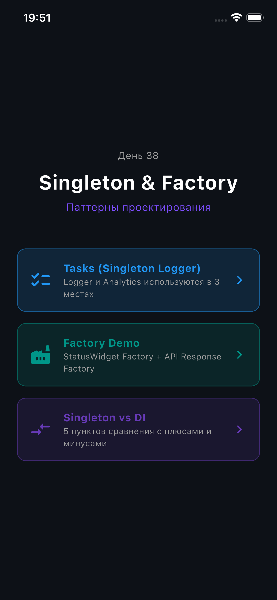
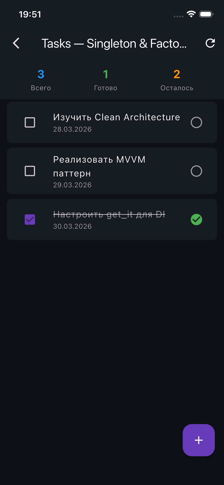

# HW37 — Clean Architecture + MVVM

> **День 37** — Переход от простых паттернов к production-ready архитектуре

Flutter-приложение "Список задач" по принципам **Clean Architecture** + **MVVM** + **Dependency Injection** через `get_it`.

---

## Структура проекта

```
lib/
├── main.dart
├── injection.dart                      # Composition Root (DI)
├── presentation/
│   ├── screens/tasks_screen.dart       # View
│   └── viewmodels/tasks_viewmodel.dart # ViewModel
├── domain/
│   ├── entities/task.dart
│   ├── repositories/tasks_repository.dart
│   └── usecases/
│       ├── get_tasks_usecase.dart
│       ├── add_task_usecase.dart
│       ├── toggle_task_usecase.dart
│       └── delete_task_usecase.dart
└── data/
    ├── models/task_model.dart
    ├── datasources/local_tasks_datasource.dart
    └── repositories/tasks_repository_impl.dart
```

## Слои

- **Presentation** — View + ViewModel (состояние, без логики в UI)
- **Domain** — Entity, UseCase, Repository Interface (чистая бизнес-логика)
- **Data** — RepositoryImpl, DataSource, Model (JSON, Firebase, API)

## DI через get_it

```dart
getIt.registerLazySingleton<TasksRepository>(() => TasksRepositoryImpl(getIt()));
getIt.registerFactory(() => GetTasksUseCase(getIt()));
getIt.registerFactory(() => TasksViewModel(getIt(), getIt(), getIt(), getIt()));
```

## Запуск

```bash
flutter pub get
flutter run
```

---

## Скриншоты

### Главный экран


### Экран задач
<p float="left">
  
  
  
</p>

### Factory Demo
<p float="left">
  
  
  
</p>

### Singleton vs DI

